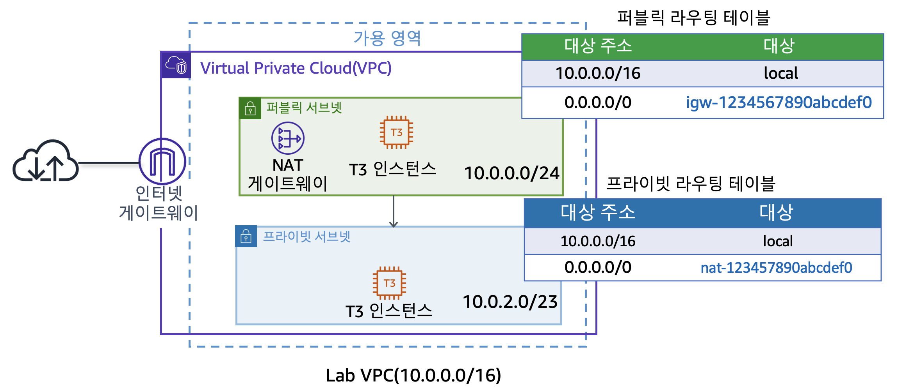
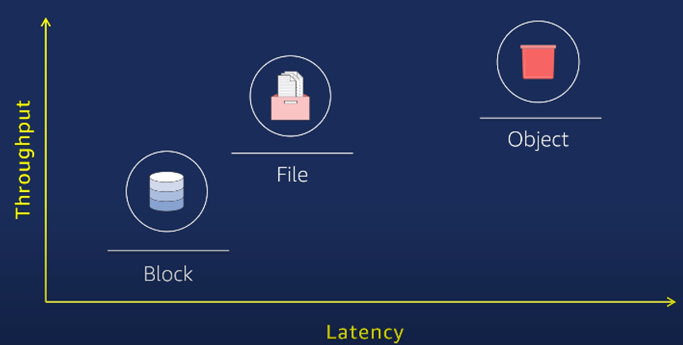
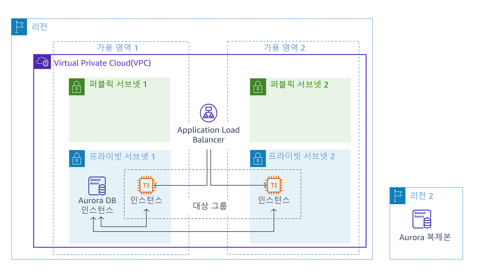
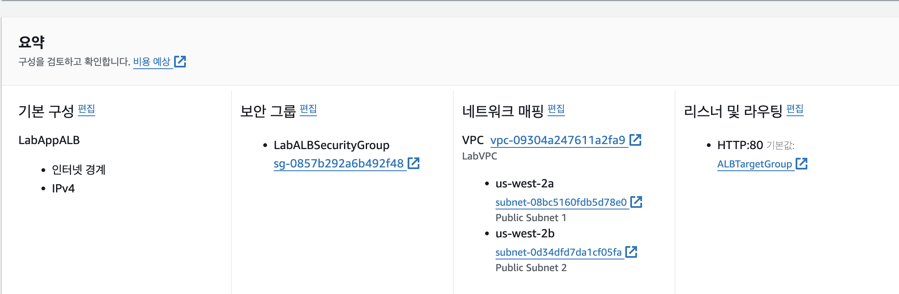
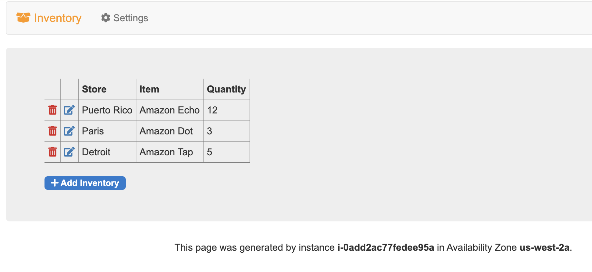

# AWS Korea 실강

<details><summary>1일차</summary>

<div markdown="1">

## AWS 사용 이점은?

엔터프라이즈급 기업에서 온 프레미스로 서버를 추가 구축하면 수개월이 걸린다.

이 과정을 분 단위로 단축시킬 수 있다.

이후 추가 구축한 리소스가 필요하지 않을 때의 처리도 용이하다.

보안을 외주로 맡길 수 있다.

## AWS Global Infra는 어떻게 이루어져 있나

가용 영역은 데이터 센터의 묶음 최소 3개의 데이터 센터

리전은 가용 영역의 묶음 가용 영역은 a~d 까지 존재할 수 있음

리전 내의 데이터 센터는 내결함성을 갖추고 있으며 서로 거리를 두고 프라이빗 링크로 연결되어 있다.

이유는 고가용성을 달성하기 위해서 자연재해, 정치적 문제 등에 의해 전체 리전이 사용불가 상태가 되는 것을 방지

**_ 상파울루 리전의 경우 자체 발전기 사용해서 데이터센터를 유지한다. 전력 비용 측면에서도 AWS 사용이 이점이 있다. _**

## Local Zone & 엣지 로케이션

리전으로부터 너무 먼 경우 리전과 고속 케이블로 연결된 별도의 센터인 로컬존에 연결할 수 있다.

짧은 지연 시간을 얻지만 모든 서비스를 사용할 수는 없다.

엣지 로케이션 각 주요 도시에서 운영되며 Route 53, CloudFront 같은 서비스를 지원

CDN을 가능케한다.

엣지 로케이션에 캐시 데이터를 저장해서 더 빠르게 접근할 수 있도록 한다.

Local Zone은 EC2, RDS 등 리소스를 더 빠르게 접근하기 위해 사용

엣지 로케이션은 데이터 캐싱, 더 빠른 콘텐츠

Well Architected Framework에서 구축한 아키텍처를 자가점검할 수 있다.

AWS는 REST API를 통해 사용자에게 AWS 콘솔, AWS CLI, AWS SDK를 통한 리소스 생성, 관리를 가능하게 한다.

API 기반의 퍼블릭 클라우드

3개의 가용 영역에 복사되어서 올라간다 s3에 이미지 올리면

`aws s3 mb [버킷명]`

`aws s3 cp [From path] [To Path]`

`aws s3 ls` - 버킷 들의 리스트

`aws s3 ls [버킷명]` - 버킷 내 파일들의 리스트

## 계정 보안

- 인가된 사용자만 접근할 수 있도록 계정을 생성하고 권한을 부여

- API 요청이 들어오면 인증 -> 인가를 거친다. 그 후 리소스에 대한 요청을 처리하고 응답을 보낸다.

- 인증은 ID/PASSWD, 인가는 권한의 확인으로 두 과정 모두 IAM이 수행한다.

- root 계정 미사용은 AWS측 모범 사례가 맞음

- 정책은 권한을 담은 JSON 형식의 스크립트

- 그 정책을 사용자에게 적용

- 혹은 사용자 그룹에 적용한 후 그룹에 사람을 추가해서 적용되도록 하는 것이 조금 더 나은 선택

- 한 사용자가 여러 그룹에 속해서 많은 권한을 가질 수도 있다.

- 역할(Role)은 정책이 부여된 리소스로 사용 가능한 사용자를 기록해두고 Role이 적용된 사용자는 그 Role의 정책을 가진다.

- 그 후 Role과의 연결을 해제하면 본래 부여받은 정책을 다시 적용받는다.

- 역할을 수임한다. assuming a role

- 보안의 주체는 어떤 작업을 수행할 수 있는 모든 대상

- 서비스가 서비스에 명령을 내릴 경우 EC2에서 S3에 AWS CLI로 접근하는 경우 EC2가 S3에 명령을 내리는 것이므로 EC2는 보안의 주체

- 그 외 계정 등

- AWS ACCESS KEY , AWS SECRET ACCESS KEY - ACCESS KEY는 Public 키 처럼 공개되어도 괜찮다. 복호화 키이자 Private Key 역할을 하는 키는 SECRET ACCESS KEY

- KEY는 aws cli 디렉토리 내 credentials_allowed에 평문으로 저장되어 있기 때문에 노트북 분실 시 Deactivate 해야 한다.

- 정책은 커스텀이던 AWS 제공 정책이던 동등하다.

- 개인을 위한 역할을 생성해서 그 역할을 적용시키는 것이 가장 안전한 방법이긴 하다.

- 이유는 그룹도 잘못 지정해서 권한없는 사용자가 Admin 그룹의 권한을 얻게 되는 경우 위험할 수도 있으니까

- IAM 역할 동작 방식은 API 요청을 보내면 AWS STS가 토큰 생성해서 임시 권한 부여

- 정책은 권한의 부여 뿐만 아니라 최대 권한 설정해서 이후 권한 부여에 대한 경계를 설정할 수도 있다.

- 정책은 주로 권한 부여의 목적으로 쓰이고 위 경계 설정은 프로젝트 초기에 할 수도 있다.

- 자격 증명 기반 정책은 사용자, 그룹, 역할에 적용되고 리소스 기반 정책은 리소스에 적용된다.

- 사용자가 리소스 액세스를 시도하면 리소스 기반 정책을 확인한다? 이건 무슨 얘기인지 모르겠는데 \***\*\*\*\*\***\*\*\*\*\***\*\*\*\*\***

- 아래 JSON은 자격 증명 기반 정책

```JSON
{
    "Version": "2012-10-17",
    "Statement": [
        {
            "Effect": "Allow",
            "Action": [
                "ec2:Describe*",
                "ec2:GetConsole*"
            ],
            "Resource": "*"
        }
    ]
}
```

- Version은 정책의 버전

- Effect는 허용의 목적인지 거부의 목적인지?

- Action은 행위에 대한 것을 의미 S3 읽기 권한이란 그런 내용

- Resource는 위 내용들이 적용되는 대상 리소스

- 복수의 정책이 적용되는 경우 거부 Effect가 우선 적용된다.

- 허용의 경우 양 정책의 교집합에 해당하는 리소스 접근이 적용된다.

- 리소스 기반 정책의 경우 리소스를 arn으로 명시한다.

```JSON
{
    "Version": "2012-10-17",
    "Statement": [
        {
            "Sid": "AddPerm02",
            "Effect": "Allow",
            "Principal": "*",
            "Action": [
                "s3:ListBucket",
                "s3:GetObject"
            ],
            "Resource": [
                "arn:aws:s3:::00-22-architecting-on-aws",
                "arn:aws:s3:::00-22-architecting-on-aws/*"
            ]
        },
        {
            "Sid": "RemovePerm",
            "Effect": "Deny",
            "Principal": {
                "AWS": "arn:aws:iam::284141907816:user/deny"
            },
            "Action": "s3:GetObject",
            "Resource": "arn:aws:s3:::00-22-architecting-on-aws/public/*"
        }
    ]
}
```

- 리소스 기반 정책은 principal이라는 요소가 있는지 없는지로 구분하면 된다. (자격증 시험에 나온다면)

- 권한 중 EC2 ReadOnly는 인스턴스를 끄거나 삭제할 수 없고 정보만 읽을 수 있다.

- 다중 계정은

- Cloudtrail은 모든 API 요청에 대한 기록을 남긴다.

- **_ISMS 인증 관련 사항 중 Cloudtrail의 기록을 3년간 투명하게 보관해야 하는 사항이 있다._**

- AWS Organization을 사용해서 계정을 조직 단위(Organization Unit)로 그룹화해서 계층 구조를 생성한다.

- 계정과 계정은 서로 완전히 격리되어 있기 때문에 조직화하지 않으면 업무량이 많아지고 관리가 어렵다.

- 조직화 방법은 계층 구조이므로 상위 계층에서 허용된 사항이 있다면 하위 계층은 반드시 그 이하의 권한을 가지도록 하는 것이다.

- 관리 계정이 총괄하고 OU를 하위에 가진다.

- OU는 하위에 OU 혹은 계정을 가진다.

- 각 계정별로 결제되는 비용도 OU 단위로 결제가 가능하다.

- SCP vs IAM

- SCP는 권한을 제한하는 필터의 역할이다.

- 실질적 허용과 거부는 IAM이 한다.

- 뭔 개소리야 그래서 정확히 어떻게 동작한다는건데---------------- 이거 나중에 다시 보게되면 자세히--------------

- SCP -> IAM 순으로 보안 증명 필요

- https://docs.aws.amazon.com/ko_kr/organizations/latest/userguide/orgs_manage_policies_scps.html

## VPC

- 가상의 격리된 네트워크를 의미

- Regional하다.

### Public Subnet

- IGW를 사설 망을 외부 인터넷과 연결하는 가상의 라우터로 볼 수 있다.

- IGW에 대한 라우팅을 설정하고 인스턴스에 공인 IP를 부여하면 외부와의 통신을 공인 IP를 통해 할 수 있고 내부 망에서의 통신은 사설 IP로 할 수 있다.

### Routing Table

- VPC는 암시적 라우터가 존재해서 라우터를 직접 구축하지 않고 라우팅 테이블에 라우팅을 명시하는 것 만으로도 라우팅이 가능하다.

### Elastic IP Address

- 인스턴스에 붙였다 뗄 수 있는 고정된 공인 IP이다.

- 리전당, 계정당 5개로 제한된다.

- Quotar, Soft Quotar

- Soft Quotar여서 5개 제한을 문의를 통해 풀 수 있다.

- Quota는 상식선에서 Limit을 거는 것

- VPC CIDR 16으로 5개면 65000 \* 5인데 이 제한이 없다면 서버의 수 상식 밖으로 많아진다.

- Hard Quota는 인터뷰 요청이 들어오고 AWS 한국 지사장의 승인이 있어야 한다.

### Elastic Network Interface

- 탄력적 네트워크 인터페이스는 같은 가용 영역 내에서 리소스에 붙였다 떼면서 사용할 수 있는 가상의 네트워크 인터페이스이다.

- 고정된 사설 IP, EIP, MAC 주소를 가지고 있다.

### NAT(Network Address Translation) Gateway

- 사설 IP 대역으로부터 외부 망으로의 Outbound 트래픽이 나갈 수 있도록 해주는 리소스이다.

- EIP를 요구한다.

- NAT Gateway를 통해 프라이빗 서브넷에서 인터넷을 사용할 수 있다.

### Network ACL

- 서브넷의 인바운드, 아웃바운드 트래픽을 제어하는 가상의 방화벽이다.

- 허용 규칙과 거부 규칙을 모두 명시한다.

- 비상태저장 방화벽이다.

- 한 트래픽 마다 들어갈때 나갈때 모두 확인한다.

- 서브넷에 배포된 모든 인스턴스에 적용된다.

### Security Group

- 인스턴스의 인바운드, 아웃바운드 트래픽을 제어하는 가상 방화벽이다.

- 허용 규칙만 명시한다.

- Source IP, Destination IP, 프로토콜, 포트를 명시해서 사용한다.

- 기본값은 모든 인바운드 트래픽을 막고 모든 아웃바운드 트래픽을 허용한다.

- 3-tier 라면

- WS 인바운드 80, 443 모든 IP에 허용

- WAS 인바운드 80 WS에 대해 허용

- DB 인바운드 3306 WAS에 대해 허용

- 이것을 Security Group Chain 이라고 한다.

- 트래픽의 접근 과정을 설명하면 IGW -> RTB -> NACL -> Subnet -> SG -> Instance

- 한 인스턴스에 복수의 SG가 적용될 수 있으며 종합적으로 평가해서 트래픽 허용 여부를 결정한다.

## 컴퓨팅

- EC2(2006) -> ECS(2014) -> Lambda(2014) -> Fargate(2017) -> Inferentia, Trainium, Graviton3(2021, 2022)

- Fargate는 서버리스 컨테이너화, 내 VPC 내에서 관리하는 서버가 없는게 서버리스인데 컨테이너를 내가 관리하지 않고 돌아가게 하는 것

- 그 뒤로는 맞춤 제작 프로세서라는데 뭔지 모름

- EKS도 쿠버네티스 기반 컴퓨팅 서비스

- CSP인 AWS의 컴퓨팅 리소스 생성 방식은 API 요청에 따라 하이퍼바이저에서 컴퓨팅 리소스(VM)를 생성하여 제공하는 것이다.

- 확장은 Scale-Out, 다시 축소는 Scale-In

### EC2

- 태그, 이름 - 사내에서 정해진 태그에 대한 네이밍 규칙을 정해서 생성한다.

- 예시 - 네이밍 룰에 따라 네임을 넣고 프로젝트를 구분해서 넣고 이 리소스가 배포 환경인지 테스트 환경인지 넣고 서비스 용도 프/백 넣고 가용 영역 구분해서 넣고 귀속 부서 구분해서 넣고

- Amazon Machine Image - OS를 포함한 리소스들을 가진 템플릿 이미지이다.

- 사전 구축된 AMI를 사용하거나 Marketplace에서 솔루션이 포함된 이미지를 사용하거나 Image Builder를 통해 커스텀 AMI를 생성한다.

- 하시코프 Packer가 이미지 빌더인듯?

#### 인스턴스 유형 이름 규칙

- c6g.xlarge

- c는 인스턴스 패밀리

- 6은 인스턴스 세대

- g는 추가 속성

- .뒤로는 인스턴스의 크기로 하드웨어 스펙의 규모 micro보다 xlarge가 더 많은 cpu, ram, ssd 가진 인스턴스

- amd는 추가 속성 위치에 a가 붙는다.

- graviton이 g인데 이게 AWS 자체 개발이라고 동일 성능일 경우 비용이 더 싸다고 합니다.

#### EC2 키 페어

- 최근엔 키 페어도 생성하지 않고 Session Manager로 접속하는 추세??

#### 테넌시

- 공유 테넌시가 기본값이며 하나의 하드웨어를 다른 사람들과 공유한다.

- 전용 인스턴스는 하드웨어를 격리해서 다른 사람과 공유하지 않고 사용한다.

- 전용 호스트는 하드웨어를 제어한다.

- 랙이 하나 있고 그 랙에 디바이스가 여러개 있는데 그 디바이스 하나의 일부를 할당 받고 그 디바이스 다른 사람과 공유하는게 공유 테넌시

- 그 디바이스 하나 아예 점유하는게 전용 호스트

- 전용 인스턴스는 그 디바이스 아예 점유는 아닌데 그 디바이스에 리소스 생성 다른 사람하고 공유 안하는거

#### 배치 그룹

- 클러스터링을 통해 여러 인스턴스를 서로 인접하게 배치해서 고성능 컴퓨팅(HPC)을 가능하게 한다.

- 중요한 인스턴스라면 분산시켜서 안정성을 높인다.

- 파티션 분리는 가용 영역 내에서 논리적 구분을 하는 것이다.

#### User Data

- EC2가 생성될 때 최초로 실행될 스크립트를 작성할 수 있다.

#### 메타 데이터

- 인스턴스 내에서 `curl http://169.254.169.254/latest/` 명령줄을 통해 생성된 인스턴스의 메타 데이터를 출력할 수 있다.

- 공인 IP 주소 등을 출력할 수 있으며 `curl http://169.254.169.254/latest/meta-data/public-ipv4`

- 이 출력되는 메타 데이터를 자동화에 활용할 수 있다.

#### Elastic Block Storage

- 하나의 EC2는 반드시 최소 하나의 EBS를 가진다.

- EBS의 크기를 늘릴 수는 있지만 줄일 수는 없다.

- 작은 크기로 만들어서 복사하고 기존 것을 지워야 한다.

- EBS 볼륨 유형은 SSD 지원하는 gp2, gp3, io1, io2가 있고 가장 고성능은 io2이다. io2 Block Express가 가장 고성능

- IOPS가 뭔지 모르겠는데 그게 성능 나타낼 수 있는 지표인듯

- HDD 지원하는 st1, sc1

#### 인스턴스 스토어 볼륨

- 인스턴스에 바로 붙이는 데이터 스토어

- 속도가 빠르다.

- 스냅샷을 미지원해서 비영구적이고 휘발성이 있다.

- 캐싱의 용도로 사용할 수 있다.

#### EC2 구매 옵션

- 온디맨드는 초당 과금

- Savings Plans를 통해 1년 또는 3년 약정으로 사용도 가능

- 스팟 인스턴스는 온디맨드 대비 90% 할인 혜택을 받아 다른 사람의 여분 EC2를 사용하는 방법이다.

- 원 사용자가 반환을 요구할 경우 복구하는 자동화를 미리 구축해두어야 한다.

- 당근마켓이 비용 절감하는 방법으로 스팟 인스턴스를 많이 썼다고 한다.

- 쓰다가 뺏길 확률은 5% 정도라고 한다. 자동화 구축할 수 있다면 충분히 가능한 부분이다.

##### Savings Plan

- Compute Savings Plan - 리전 등 선택에 있어서 유연성 확보 + 66% 할인

- EC2 Savings Plan - 72% 할인 유연성 x

- 온디맨드 + Compute Savings plan + EC2 Savings Plan + 스팟 인스턴스를 잘 조합해서 비용 절감을 해야 한다.

### AWS Lambda

- 서버리스 컴퓨팅으로 Memory만 직접 스펙을 결정한다. Memory를 늘리면 CPU는 알아서 늘어난다.

- 서버리스는 실행될 때 마다 그리고 실행된 시간 만큼 비용이 발생하는 것이다.

- 24시간 내내 꽉찬 워크로드는 잘 없다. EC2 같은 리소스 쓸 때 평균 30% 정도 사용되면 잘 쓰는 것이다.

- 코드는 S3에 저장되고 필요한 경우에 호출된다.

- Lambda도 이중화 가능하다.

- API Gateway를 생성해서 생성한 Lambda의 API를 밖으로 내보낼 수 있다.

- 서버리스로 Lambda에 코드만 작성하고 API Gateway를 사용해서 API URL을 만들어내고 그 API URL을 어디서나 접근할 수 있도록 배포할 수 있다.

## 실습

- 

- 퍼블릭 서브넷에 퍼블릭 서버 생성, 프라이빗 서브넷에 프라이빗 서버 생성

- 프라이빗 서버 NAT GW에 연결

- SG 포트 포워딩 후 통신 확인

- 

- ICMP 프로토콜에 대한 허용 후 ping 트래픽 전달

- 

- 

- 

- 인스턴스의 메타데이터 리스트 출력하고 그 중 원하는 데이터 출력하기

## 추가 내용

- byoip는 통신사에서 직접 고정 IP를 사서 사용하는 것

</div>

</details>

<details><summary>2일차</summary>

<div markdown="1">

## 서버리스

- BTS 관련 온라인 서비스는 모두 서버가 터지는데 API GW + Lambda 조합으로 연말 콘서트 티켓팅을 했을 때는 서버가 터지지 않았다고 한다.

- Lambda가 백엔드 서비스에 접근해서 요청을 처리할 수도 있다.

- 챗봇도 Lambda를 활용해서 채팅 질문 -> API GW -> Lambda -> 챗봇 회사의 AI가 요청 처리 처럼 가능하다.

- Lambda 함수 하나의 실행 시간은 15분 미만이다. 요청 1회에 대한 처리에 걸릴 수 있는 최대 시간이라는 말

- 메모리 128MB ~ 10GB

- 배포 패키지 크기 제한이 있는데 이것도 컨테이너를 사용해서 해결할 수 있다.

## 스토리지

- 블록 스토리지, 파일 스토리지, 객체 스토리지로 나뉜다. 이거 앞에 온프레미스 한거에다가 다시 정리하자.

- SSD, HDD 같은 HW에 붙어있는 물리 스토리지는 기본적으로 블록 스토리지이다.

- 블록 스토리지는 블록 단위로 저장하며 파일 크기 만큼 블록 수를 차지한다.

- 수정이 용이하고 속도가 빠르다.

- 파일 스토리지는 파일 시스템을 다른 디스크에 연결(마운트)해서 공유할 수 있도록 하는 것이다.

- 네트워크를 통해 연결되므로 물리적 연결보다 느리지만 확장성이 좋다.

- 객체 스토리지는 스토리지라기보다 솔루션에 가깝다.

- 객체 스토리지는 Get, Put 할때마다 한번씩 요청과 응답이 이루어지는 비연결성 API 기반 솔루션이다.

- 객체의 ID, 메타데이터, 데이터 속성, 데이터를 저장해두고 그 정보에 기반해서 객체에 접근한다.

- EBS가 기본 블록 스토리지이다.

- EFS는 NFS에 기반한 AWS 파일 스토리지 시스템이다. FSx는 SMB 프로토콜에 기반한 Window용 파일 스토리지 였지만 for Window만 윈도우용이고 성능 활용을 위한 다른 기종에서도 사용 가능한 FSx들이 있다.

- 객체 스토리지는 S3.

- S3를 쓰면 S3는 기본적으로 복사해서 여러 곳에 백업을 해두기 때문에 안전하다.

- 파일 형식에 상관없이 모두 저장할 수 있다. 미디어 스토리지로서의 역할 가능하고 빌드할 아티팩트를 저장하는 데에도 사용할 수 있다.

- S3 버킷 이름은 Global Unique 해야 한다.

- 그럼 Unique한 Key가 되고 버킷 내의 파일명도 Unique하다면? Key 기반 탐색이 얼마든지 가능하다. S3 URL을 통해 파일 쉽게 접근 가능

- `버킷명.s3.리전코드.amazonaws.com/파일경로`

- 버킷 내에서도 디렉토리를 생성할 수 있다.

- 객체 스토리지는 속도가 가장 느리지만 1개의 파일 접근과 1000개의 파일 접근이 속도 차이가 없기 때문에 더 효율적일 수 있다.

- 메타데이터를 함께 저장하고 그 메타데이터를 기반으로 검색할 수도 있는데 이러면 실제 데이터 검색보다 더 적은 데이터 양으로 빠르게 검색 가능한 것이다.

- 버킷에 리소스 기반 정책을 적용시켜서 접근을 제어할 수 있다.

- 실제 미디어 스토리지로서의 역할은 VOD 파일을 S3에 넣어서 저장하고 VOD 서비스를 엣지 로케이션을 통해 제공한다. KBS 자카르타 아시안게임

- 

### 객체 보호

- 객체 데이터의 접근을 제어하고 데이터를 암호화한다.

- 그리고 삭제를 할 수 없게 하는 규정을 생성해 준수하도록 한다.

- S3는 기본적으로 프라이빗 버킷이며 소유자만 접근 가능하다.

- 액세스 정책을 통해 제어된 엑세스를 가능케한다.

- 버킷 정책은 리소스 기반 정책으로 대상이 될 S3를 명시하고 Principal에 접근 가능한 사용자 명시? 인듯 그리고 Action에 읽기 가능인지 버킷 리스트 확인 가능인지 그런 내용. 나중에 다시~

- Principal을 \*로 해서 모든 정보가 유출되는 경우가 있을 수 있기 때문에 S3 퍼블릭 액세스 차단 기능이 있다.

- S3는 크기 제한이 없다. S3 내에서 디렉토리를 구분해서 액세스 포인트 정책을 적용해 하나의 S3를 부서마다 분리되도록 할 수 있다.

- S3는 파일 암호화에 S3 관리형 키, KMS 키, 고객 제공 키를 사용한다. 각 키 모두 SHA256을 사용한다.

- 관리형 키는 SSE-S3로 별도 비용없음 S3에서 생성되기 때문

- KMS는 키를 S3를 사용하는 회사가 소유해야 한다는 것에서 생겨났다. 직접 생성한 키이기 때문에 비용 발생한다.

- 내가 가진 키 관리 시스템에서 API 요청을 보낼때 헤더에 담아서 보낸다. 잘 사용되지 않는다. 보통 관리형 키, KMS를 사용

### 스토리지 클래스

- S3는 클래스가 나뉘어져 있으며 가성비에 맞게 사용할 수 있다.

- 높은 비용 + 액세스 빈도가 높은 클래스와 낮은 비용, 액세스 빈도가 낮은 클래스로 나뉜다. 스탠다드와 글래셔

- 스탠다드는 자주 접근하는 데이터, 캐시 데이터, 디버그 데이터 등에 사용할 수 있고 글래셔는 아카이브된 데이터?? 생활기록부처럼 오래 보관해야 하지만 접근하지 않는 그런 데이터

- 왼쪽은 데이터 저장 비용은 높지만 액세스에는 낮은 비용 오른쪽은 그 반대

- 아무튼 자주 쓰는거 잘 안쓰는거에 따라서 나누고 왼쪽에서부터 오른쪽으로 갈수록 덜 쓰는 데이터 저장에 쓰이는 S3 버킷 클래스

- 클래스의 변경은 회사에서 API 요청으로 사용중인 버킷의 클래스를 바꿀 수 있었다.

- 지금은 하나의 방법으로 S3 Intelligent-Tiering이 머신러닝 기법으로 액세스 패턴을 파악해서 자동 전환을 하도록 하다.

- S3 라이프 사이클 정책을 지정해서 3개월 뒤에 어떤 클래스로 6개월 뒤에 어떤 클래스로 3년이 지나면 삭제해라 같은 정책을 적용 가능

### S3 버전 관리

- S3 버전 관리는 이전 버전의 버킷도 비용을 받는다.

- 이전 버전으로 롤백도 가능하고 이후 안쓰는 버킷 자동 삭제되도록 할 수도 있다.

### 객체 복제

- 데이터의 백업을 위해 다른 리전에 S3 버킷을 복제해서 데이터 내구도를 향상시킨다.

### S3 Transfer Acceleration

- 먼 리전에 있는 버킷과 파일을 주고 받을 경우 속도가 느리기 때문에 가장 가까운 엣지 로케이션 까지만 인터넷으로 통신하고 그 다음부터는 AWS 내의 망을 통해 통신해서 더 빨리 할 수 있도록 한다.

### S3 이벤트 알림

- 특정 파일이 버킷에 업로드될때 설정해둔 이벤트에 해당하는 파일일 경우 Lambda를 통해 썸네일 버킷에 옮겨담는다.

### S3 비용 관련 요소

- 스토리지 유형 위에 말한 클래스들에 따라 비용 나뉘고 요청, 검색마다 비용 발생하고 버킷 복제랑 버전 관리도 다 비용 발생

- 버킷이 있는 리전 밖으로 나가는 데이터 전송 시에만 비용 발생

## 공유 파일 시스템

- 공유 파일 시스템 서비스로는 AWS EFS, FSx가 있다. EFS가 가장 많이 쓰인다.

- IOPS가 10000~20000정도면 스토리지의 성능은 최상이다.

- 하나의 공유 파일 스토리지는 1000개의 인스턴스에 마운트될 수 있다. 이거 soft quotar

### EFS

- NAS를 구축할때 스펙을 지정해야 하지만 EFS는 완전관리형으로 생성하고 NFSv4 프로토콜을 사용해서 마운트하면 된다.

- 하나의 EFS를 여러 인스턴스가 접근하고 사용할 수 있다.

- 저장에 대한 비용과 요청 처리에 대한 비용이 있다.

- EFS도 S3처럼 클래스가 있고 클래스를 나누는 기준은 거의 동일하다.

- 자주 접근하는 데이터를 가지고 있다면 EFS 스탠다드 잘 쓰지 않으면 EFS 아카이브

### FSx

- 원래 윈도우를 위한 파일 시스템 스토리지지만 지금은 FSx for Windows File Server가 윈도우용

- FSx for Luster 완전관리형으로 고성능 수백만 IOPS까지 가능 대다수 리눅스 AMI와 호환됨

## 데이터 마이그레이션

- AWS Storage Gateway는 온 프레미스 데이터 스토리지에 Gateway를 생성해서 기존 온 프레미스에서 구축한 데이터 스토리지를 각각 대응되는 파일 게이트웨이를 통해 그대로 마이그레이션 할 수 있다.

## AWS Datasync

- 온 프레미스에 DataSync 에이전트를 설치하면 AWS에서 스토리지에 동기화한다.

# 데이터베이스

- AWS DB 종류는 DynamoDB와 Aurora Serverless와 같은 완전 관리형과 RDS같은 관리형 데이터베이스로 나뉜다.

- AWS elastiCache는 Redis를 캐싱 용도로 사용할 수 있는 데이터베이스 서비스

- 관계형 vs 비관계형을 AWS 서비스 관점에서는 관계형 데이터베이스는 엄격한 관리가 필요할 때 그대로이고 비관계형 데이터베이스가 수평적 확장으로 성능을 더 낼 수 있다.

## RDS

- DB를 포함한 인스턴스이고 모니터링을 기본으로 제공한다.

- 데이터의 저장 및 전송 모두 암호화를 제공한다.

- StandBy DB도 제공된다. Multi AZ DB 인스턴스가 제공된다는 것

- 스펙 확장과 마이그레이션도 제공된다.

- 다중 AZ 옵션을 켰을 때 두 가용 영역을 지정하고 DB인스턴스를 각각 생성한다.

- DB에 쓰기 요청을 할 경우 Primary DB의 데이터를 StandBy에 동기화까지 되고 나서 쓰기 요청 처리가 끝난다.

- Primary가 다운되면 StandBy가 Primary가 되고 새로운 대기 인스턴스를 이전 Primary의 AZ에 생성하고 그 인스턴스가 StandBy가 되며 거기에 동기화도 이루어진다.

- 읽기 전용 복제본을 RDS는 5개 오로라는 15개를 만들 수 있다.

- 읽기 전용 복제본은 읽기 : 쓰기 = 8 : 2 이기 때문에 읽기 성능을 개선하기 위해 사용한다.

- R/W 엔드포인트와 R 엔드포인트 두개를 가지고 덜 중요한 정보의 읽기 처리는 복제본으로 보낸다.

- 복제본은 리전에 한정되지 않는다. 다른 리전에 읽기 전용 복제본을 생성할 수도 있다.

- KMS 키를 사용해서 RDS에 저장되는 데이터를 암호화할 수 있다.

## Aurora

- MySQL, PostgreSQL 호환 관계형 데이터베이스

- 오로라 클러스터는 6개의 복제본을 3개의 AZ에 저장한다.

- 복제본은 각 AZ에 5개 까지 총 15개 까지 가능하다.

### Aurora Serverless

- DB의 사용량 차이가 큰 경우 그러니까 가장 사용량이 많을 때와 적을 때의 차이가 크고 그 빈도가 큰 경우 이 서비스를 사용하는 것이 낫다.

## Dynamo DB

- 사용자는 테이블만 만들어서 사용하면 되는 완전관리형 데이터베이스이다.

- 규모에 맞게 성능이 쉽게 튜닝되고 엔터프라이즈급에도 사용할 수 있다.

- 유연한 스키마를 제공한다. 각 레코드가 PK만 지키면 어떤 컬럼을 생략하던 추가하던 상관없다.

- 이유는 사실 JSON으로 관리되기 때문이다.

- 3개의 AZ에 복사해서 저장한다.

- 게임사의 사용자 프로필같은 데이터를 DynamoDB에 사용할 수 있고 이커머스사의 상품데이터도 DynamoDB에 사용할 수 있다. 성능이 좋은 서비스이다.

- 과금은 온디맨드, 프로비저닝 방식이 있다.

- 온디맨드는 요청당 요금을 부과한다. 사용량에 따라 알아서 증설되고 줄어든다.

- 프로비저닝은 수요를 예측해서 사용한다. 온디맨드 vs 프로비저닝은 7배 정도 가격 차이가 있다고 한다.

- Dynamo DB는 프로비저닝해서 써야하나보다.

## ElastiCache

- 캐싱 목적의 인메모리 DB를 제공하는 서비스이다. 멀티 AZ가 가능하다.

- 완전관리형이고 인메모리 데이터베이스지만 다운되면 그 백업 데이터베이스가 백업한다.

- 몇몇 게임사는 퍼포먼스를 위해 아예 DB를 사용하지 않고 인메모리 DB만을 사용하고 주기적으로 백업을 하는 경우도 있다. 이렇게 하면 ns단위의 결과를 낼 수 있다.

- 확장도 가능하다.

- 국내에서는 ElastiCache for Redis를 주로 사용한다.

- 이유는 고급 데이터 형식을 지원하기 때문이다. 고급 데이터 형식 사용의 예를 들면 게임사에서 사용자 프로필에 상위 몇 퍼센트인가를 실시간으로 나타내는 경우 레디스에서 이 기능을 사용한 것

### 캐싱 아키텍처

- 캐싱 클러스터를 구축하면 App에서 캐시 클러스터에 먼저 접근해서 Cache Hit, Cache Miss인지에 따라 DB에 접근할 지 말지를 결정한다.

- 그냥 당연한 캐싱 방식이고

---

오늘 내용 대체로 좋았는데 기존 DB나 데이터 스토어나 그런게 어떻게 AWS 서비스랑 대응되는가 같은 내용들 너무 좋았는데 너무 하나의 AWS 서비스가 어떻게 동작하는가 어떤 서비스를 제공하는가 까지 간게 너무 많았다. 아득해진다..

---

## 데이터베이스 마이그레이션

- 기존 전통적 마이그레이션 방식에선 엑셀로 직접 다 눈으로 보고 손으로 해야 한다. 그런데 내일되면 또 컬럼 바뀌고 데이터는 계속 생긴다.

- AWS에서는 마이그레이션할 때 스키마를 옮기는 부분은 자동으로 가능한 부분을 측정해서 알려주고 진행해주며 무료로 가능하다.

- 스키마 마이그레이션 이후 데이터 마이그레이션은 DMS로 복제를 하면서 변경사항도 계속 반영??????

- LG U+가 온프레미스 데이터베이스를 AWS로 마이그레이션할때 DMS를 썼다고 한다. 이건 DB서버 하나당 EC2사용량 만큼의 비용은 발생한다고 한다.

# AWS 서비스를 통한 CI/CD

- CodeCommit이 레포지토리 CodeBuild로 그 코드 빌드 둘다 완전관리형 CodeBuild가 돌아간 만큼만 비용 발생

- 빌드된 아티팩트 S3에 넣던 컨테이너에 넣던 할 수 있다.

- CodeDeploy로 배포를 진행한다.

- CodeDeploy로 무중단 배포를 가능케한다. 배포 유형 옵션도 제공한다. 블루-그린, 카나리 등

- CodePipeline이 소스 -> 빌드 -> 테스트 -> 스테이징 -> 테스트 -> 프로덕션의 각 단계별로 필요한 서비스를 모두 적용시켜준다???

- 블루그린이 v2를 생성해서 문제 없으면 v1과 교체하고 v1을 삭제하는 방식이던가??

# 실습 DB 생성하고 다른 리전에 읽기 전용 복제본 생성 + ALB 생성

- 

- CLB vs ALB는 ALB는 Lambda를 포함해 모든 어플리케이션에 대한 로드밸런싱이고 CLB는 클래식 EC2기반 환경에서의 로드밸런싱

- 대상 그룹에 서버 인스턴스를 추가하고 그 다음 로드밸런서를 생성

- 

- ALB는 모든 IP로부터 HTTP -> APP은 ALB의 SG로부터 HTTP -> DB는 APP의 SG로부터 3306

- 

- Endpoint를 통해 DB 연결 후 확인 (제공된 웹서버에 미리 배포된 Endpoint로 DB 연결하는 App을 통해서)

# 모니터링과 스케일링

## AWS CloudWatch

- 리소스의 사용량을 모니터링하고 로그도 수집해서 로그도 모니터링한다.

- NMS에서 디바이스별 지표처럼 인스턴스의 ID로 검색해서 인스턴스별 지표 그래프를 모니터링할 수 있다.

- 임계점 설정 후 알림을 임계점을 몇번 넘었을 때 받을지 등도 설정 가능

## CloudWatch Logs

- 가장 첫번째로 트래픽을 받는 로드밸런서의 로그를 가지면 모든 로그를 파악할 수 있다??

- Agent를 사용하면 온프레미스에서도 CloudWatch를 사용해서 로그를 모니터링할 수 있다.

## CloudTrail

- API 요청에 대한 내용과 그 요청 처리 후 응답에 대한 기록

- StateCode를 통해 응답이 잘 처리되지 않았을 경우 어떤 문제로 되지 않았는지 확인이 가능하다.

## VPC Flow Log

- VPC 내에서 트래픽의 흐름에 따른 로그

## Event Bridge

- AWS에서의 지표를 통해 Datadog 같은 다른 솔루션에서 지표에 기반한 작업을 수행하게 할 수도 있다.

# 로드밸런싱

- 리스너 하나와 타겟 그룹 하나가 연결되어 있으며 하나의 타겟 그룹엔 복수의 대상(인스턴스 혹은 다른 서비스)가 있을 수 있다.

## ALB

- 도메인에 기반한 유연한 로드 밸런싱이 가능하다. L7 로드밸런서이다.

- 고정 IP가 기본적으로 제공되지 않고 DNS가 제공된다.

## NLB

- L4 로드밸런서로 대용량 트래픽을 받을 수 있다.

- IP 기반 로드밸런싱이 필요한 경우 ALB 앞에 NLB를 붙이는 경우도 있다.

- 데브시스터즈의 인프라는 트래픽 대처를 위해서 NLB를 사용하고 ALB가 제공하는 유연한 로드밸런싱은 팀이 직접 담당해서 구축하는 방향으로 되어있다고 한다.

- 고정 IP가 제공된다.

## GLB

- L3 로드밸런서로 보안 목적으로 쓰인다는 것만 알아두자. 트래픽의 들어가고 나감이 투명하게 나타난다???

# 오토 스케일링

- 트래픽이 몰리는 상황에 대비해 서버를 자동으로 증설하는 것

- 수요 예측대로 리소스를 준비할때 생기는 비용 문제를 방지하기 위함? 트래픽을 감당하기 위함? 둘 다 위해서

- Auto Scaling 자체가 하나의 서비스이며 시작 파라미터로 인스턴스 하나를 생성할때 처럼 원하는 스펙과 AMI를 설정한다. (Pre-Making)

- 워크로드를 사람이 예측해서 오토 스케일링 시점을 예약한다. (예약 스케일링)

- CloudWatch가 보여주는 수치(다른 지표도 있는듯)에 기반해서 오토 스케일링을 결정한다.(동적 스케일링)

- 예측 스케일링은 어떤 경우고 어떻게 이루어지는지 다시 ----------------------------------

</div>

</details>
