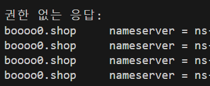
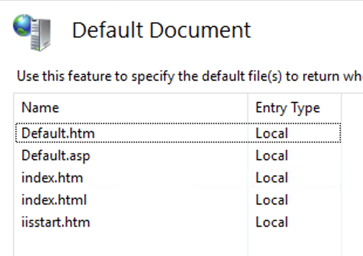
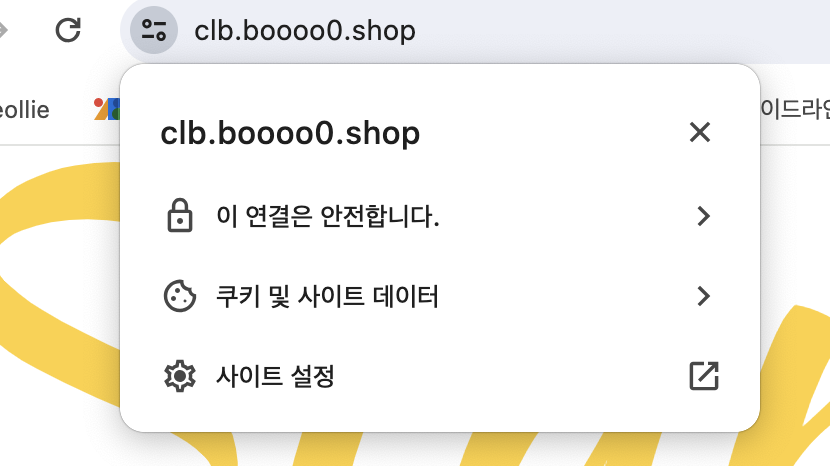

# Route 53

- AWS가 제공하는 도메인 네임 서비스이다.

- 하나의 Route 53은 복수의 리전에 구축한 모든 VPC에 대해 적용될 수 있으며 이를 통해 GSLB라는 로드 밸런싱이 가능하다.

- 예를 들면 서울 리전, 도쿄 리전이 하나의 서버 인스턴스처럼 되고 Route 53이 로드 밸런서가 되는 것이다.

- DNS의 전체 동작 방식에서 2차 루트 -> TLD -> 2차 도메인 서버에서 2차 도메인 서버의 역할을 한다.

## 도메인 등록

- Route 53 대시보드에서 도메인을 등록할 수 있다.

- 직접 AWS에서 도메인을 구매할 수도 있고 미리 구매한 도메인을 등록할 수도 있다.

### 호스팅 영역 구성

- 구매한 도메인을 입력하고 용도에 따라 퍼블릭 도메인 또는 프라이빗 도메인으로 생성한다.

- 생성한 호스팅 영역의 NS를 구매한 도메인의 네임 서버로 변경한다.

- 직접 구매한 도메인은 그 도메인을 제공하는 기업에서 호스팅 되기 때문에 구매한 도메인이 제대로 작동하려면 가비아에서 구매한 것이라면 가비아 홈페이지에서 내가 구매한 도메인의 네임 서버 설정에 Route 53에서 생성된 호스팅 영역에 명시된 네임 서버 주소를 입력해줘야 한다.

- 그 후 `nslookup -type=ns [도메인 네임]`으로 설정을 확인할 수 있다.

- 

- CNAME - 도메인을 다른 도메인으로

- PTR - 도메인 네임 시스템의 역방향

- 생성한 호스팅 영역에서 DNS를 직접 생성할 때 db 파일에 레코드를 추가하던 것 처럼 레코드 생성을 선택해 서브 도메인에 해당하는 IP를 입력하고 레코드를 생성할 수 있다.

- 호스팅 영역당 12시간에 0.65$씩 과금

- 레코드가 가지는 상세 데이터 중 TTL 값이 작을수록 빠르게 대처가 가능하다? 뭔말

- 레코드는 인스턴스가 재시작되어 IP가 변경되는 상황이 생길 수 있으므로 고정된 EIP를 사용해야 한다. 아마 LB를 사용한다면 LB에 EIP를 부여해서 사용할 것 같다.

## 재해복구

- 서울 리전에 문제가 생겨서 동작하지 않는 경우 생성해둔 레코드의 값을 다른 리전의 인스턴스의 IP로 변경해서 재해복구를 해서 서비스를 유지할 수 있다.

- 이걸 자동화하는 방법은 없는지..?

# EBS (Elastic Block Store)

- EBS에는 OS가 설치되고 App이 설치되는 루트 볼륨과 홈 디렉토리가 포함되는 블록 스토리지

- 영구 볼륨으로 EC2가 삭제되더라도 유지할 수 있다.

- 생성된 인스턴스와 같은 가용영역에 생성되어 인스턴스에 attach 된다.

- EBS 볼륨 정보에 나오는 스냅샷이라는 정보는 AWS에서 인스턴스를 생성할 때 사용하는 OS가 설치된 상태의 스냅샷을 의미한다.

- 볼륨 생성과 연결은 콘솔의 EBS 볼륨 페이지에서 EBS의 스펙을 지정하고 연결할 때는 연결할 인스턴스를 정하고 인스턴스에서의 디스크 이름을 지정할 수 있다.

- 추가 볼륨의 연결 후 파일 시스템 포맷과 마운트는 기존 `mkfs`, `mount` 명령어를 그대로 사용한다.

## 루트 볼륨 확장

- 볼륨 설정에서 인스턴스 생성때 함께 생성했던 루트 볼륨의 크기를 재설정해서 확장할 수 있다.

- 기존 볼륨보다 더 작은 크기로 축소는 불가능하다.

- 콘솔 혹은 IaC에서 확장한 후 서버 내에서 추가적인 설정이 필요하다.

- 서버 내 설정 전에는 `lsblk`로 확인했을 때 루트 볼륨 디스크의 크기는 확장되어 있지만 루트 디렉토리 파티션의 크기는 확장되지 않아 `df`로 확인하면 적용이 되어 있지 않은 것을 확인할 수 있다.

- `growpart /dev/[디스크의 장치명] 1` 명령어를 사용하면 루트 디렉토리 파티션의 크기도 확장이 적용된다.

- `xfs_growfs -d [마운트 대상 디렉토리 경로]`를 사용하면 파일 시스템에도 확장이 적용되어 `df` 명령어로 루트 디렉토리에 마운트된 파티션의 확장된 크기가 적용된 것을 확인할 수 있다.

- 위 내용은 CentOS 기준이다.

## EBS Snapshot

- EBS 스냅샷은 다른 스냅샷과 마찬가지로 백업의 기준으로 사용될 수 있다.

- EBS는 스냅샷과 스냅샷 사이의 변경된 점만을 저장한다??? 증분식??

- App이나 OS에 의해 캐시된 데이터는 저장되지 않는다.

- 스냅샷을 생성한 다음 할당된 스냅샷 ID로 새로운 볼륨을 생성할 때 그 스냅샷을 적용시켜 생성하고 다른 인스턴스에 마운트시킬 수 있다.

### 이미지 생성

- 인스턴스의 특정 시점의 이미지를 생성해서 인스턴스를 생성할 때 사용했던 기본 제공 AMI처럼 커스텀 AMI를 만들어 사용할 수 있다.

- 이미지가 생성될 때 틀이 되는 인스턴스의 EBS 볼륨의 스냅샷도 생성된다.

- 오토 스케일링을 할 때 이 이미지를 사용할 수도 있다. 그렇게 되면 기본 AMI에 User Data로 환경 설정을 하는 것 보다 더 빨리 원하는 환경이 구성된 인스턴스를 생성할 수 있다. 자동화 효율 상승

- 인스턴스에서 이미지 생성도 가능하고 스냅샷에서 이미지 생성도 가능하다.

### 스냅샷 복사

- 스냅샷을 복사해서 다른 리전으로 보낼 수도 있다.

- 복사해서 사용하기 위해서 혹은 다른 리전에 백업해두기 위해서 사용할 수 있다.

- 리전간 데이터 전송 비용이 발생한다. 한번에 약 20원

# IAM

- DevOps에 대한 생각으로 IAM 그룹을 이해하면 개발자가 모든 권한을 가지고 인프라를 생성, 수정할 수 없으니 제한된 권한을 부여하고 요청에 따라 운영에서 인프라를 생성, 수정하는 것

- ex) EC2ReadOnlyAccess를 개발자 그룹에 부여하고 증설 요청 등은 운영팀에서 받아서 응답

## MFA (Multi Factor Authentication)

- 다요소 인증, 요소는 id/pw 같은 지식 요소, OTP 같은 속성 요소, 홍채, 지문, 목소리, 정맥같은 소유 요소가 있다.

# EC2 요금 관련

- 이전에 정리했던 스팟 인스턴스는 경매 형식으로 내가 최고가로 입찰했을 때는 내가 사용할 수 있다.

- 금액이 일반 인스턴스보다 싸지만 그렇게 큰 이득이 되지 않을 수도 있다.

- 낙찰되어 사용하는 중에도 경매는 계속되어 다른 사람의 소유가 될 수도 있다.

# IIS

- Win 서버의 WS이다.

- 홈 디렉토리의 엔트리 포인트 html파일에 우선순위가 존재한다.

- 

# RDS

- AWS에서 제공하는 완전관리형 관계형 데이터베이스 서버로 자동 백업, 고가용성, 오토 스케일링, 보안을 제공한다.

- Master <-> Slave의 Failover 기능을 제공한다.

- 서버 스펙은 db.x.x로 구분되고 db.t3.x는 모든 가용 영역에 생성할 수 있다.

- 마이너 버전 자동 업그레이드 옵션을 사용하면 mysql 8.x.27에서 가운데 마이너 버전을 자동으로 업그레이드 한다.

- WS, WAS에서의 접근 URL은 RDS를 생성하면 발급되는 엔드포인트로 접근할 수 있으며 할당된 DB user, passwd를 알맞게 입력하면 DB에 데이터를 읽고 쓰고 수정하고 지울 수 있다.

## Aurora

- AWS가 제공하는 성능이 향상된 MySQL로 요금이 더 발생한다.

## DB 서버 운영

- 멀티 티어 아키텍처에서 Bastion - WS - WAS - DB 구조에서 DB 서버에 접근하려고 한다면 보안을 위해 저 모든 구간을 지나서 DB 서버에 접속해야 한다.

## RDS Proxy

- 인증서를 통해 데이터를 암호화하 할 수 있고 부하 분산, 고가용성을 제공하는 서비스이다.

# CloudShell

- aws cli 명령어를 권한에 구애받지 않고 사용할 수 있다.

- CloudShell은 내가 만든 VPC 내에 존재하지 않아서 보안 그룹이 내부망에만 열려 있다면 인스턴스에 접속이 어렵다.

# ACM (AWS Certificate Manager)

- TLS를 위한 인증서를 관리해주는 서비스로 HTTPS 접속이 가능하게 한다.

- 무료 서비스이다.

- ACM 인증서는 ELB, CloudFront, API Gateway를 통해서만 배포되기 때문에 ACM을 통해 HTTPS 접속이 가능하려면 위 서비스들을 사용해야 한다.

- ACM에서 내 도메인을 `*.내도메인.내도메인`과 같이 입력하고 DNS 검증을 체크하고 인증서 발급을 요청하면 검증이 필요하고 생성된 인증서 상세 정보에서 Route 53에서 CNAME 레코드를 생성한다.

- 그 레코드를 통해 DNS 소유권을 AWS에서 확인하고 그때부터 내 도메인 네임 아래 모든 서브 도메인에 대한 접속이 HTTPS 접속이 가능해진다.

# ELB (Elastic Load Balancing)

- 로드 밸런서에는 ClassicLB, NetworkLB, ApplicationLB, GateWayLB가 있다.

- ClassicLB는 L7 로드밸런서로 VPC 환경 이전 클래식 환경의 클라우드를 사용하던 시기의 로드밸런서이다. 지금도 존재하고 EKS에서 CLB를 사용한다.

- NetworkLB는 L4 로드밸런서이고 ApplicationLB는 L7 로드밸런서이다.

- GWLB는 보안 관련 솔루션 서버를 사용하는 경우 그 서버를 경유해 보안 절차를 거친 후 다시 GWLB를 거쳐 App으로 트래픽이 유입되게 하는 경우에 사용할 수 있다.

- 위 로드밸런서 모두 TLS 인증서를 적용시킬 수 있다.

- 위 로드밸런서 들은 연결된 뒷단의 서버 인스턴스들의 Health check를 지속적으로 하며 문제가 생긴 서버에는 트래픽을 보내지 않는다. 사용자에게 404 등의 에러 페이지를 최대한 보여주지 않기 위함이다.

## CLB 생성

- 인터넷 경계(internet facing)와 내부 중 생성할 위치를 선택한다. 인터넷 경계를 선택할 경우 퍼블릭 서브넷에 생성된다.

- 그 다음 네트워크 매핑을 통해 퍼블릭 서브넷을 명시해주는데 이 영역으로 들어오게 될 트래픽을 LB가 받게 하겠다는 의미로 뒷단이 될 서브넷의 명시가 아니다.

- 리스너의 포트와 그 트래픽을 받을 인스턴스의 포트를 명시하고 인증서 등을 명시하고 상태 검사 상세 내용을 명시하고 로드밸런서의 대상이 될 인스턴스들을 명시하면 CLB의 생성이 완료된다.

- LB의 상태 검사의 대상이 되는 인스턴스의 WS의 엔트리 포인트를 설정하는데 그 엔트리 포인트가 맞지 않는 서버가 있는 경우 상태 검사를 통과하지 못해서 트래픽을 받지 못한다.

- 위 윈도우 서버 엔트리 포인트의 우선순위에 대해 명시한 부분에서 Default.htm을 index.html로 수정해서 작동이 되도록 할 수 있다.

- 이후 CLB의 도메인으로 접속을 하면 HTTPS가 적용이 되지 않는다. 이유는 우리가 발급한 인증서는 우리의 도메인 네임에만 해당되는 것이지 CLB를 생성했을 때 발급되는 AWS에서 발급한 도메인에 적용이 되는 것은 아니기 때문이다.

- Route 53에서 레코드를 별칭 옵션을 사용해서 생성한 CLB에 서브 도메인을 적용해서 레코드를 생성한다.

- 
