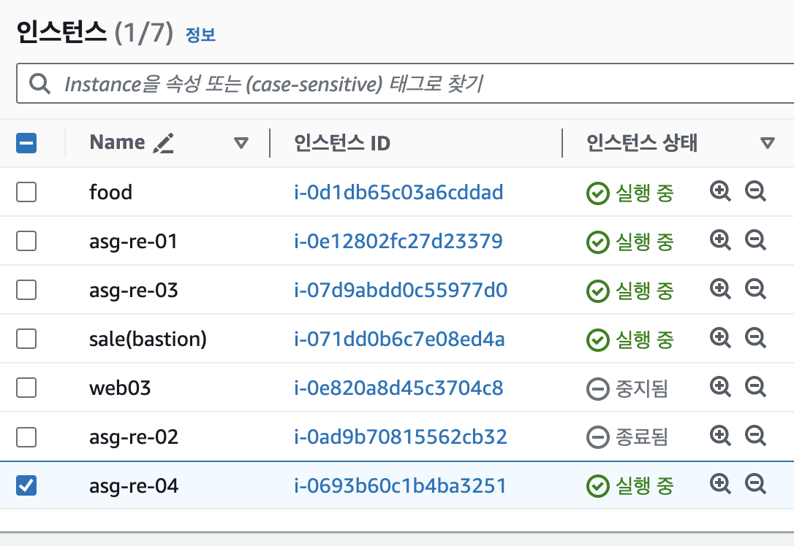

# Route 53

- AWS가 제공하는 도메인 네임 서비스이다.

- 하나의 Route 53은 복수의 리전에 구축한 모든 VPC에 대해 적용될 수 있으며 이를 통해 GSLB라는 로드 밸런싱이 가능하다.

- 예를 들면 서울 리전, 도쿄 리전이 하나의 서버 인스턴스처럼 되고 Route 53이 로드 밸런서가 되는 것이다.

- DNS의 전체 동작 방식에서 2차 루트 -> TLD -> 2차 도메인 서버에서 2차 도메인 서버의 역할을 한다.

- Route 53이 아키텍처 토폴로지에서 위치하는 곳은 범례처럼 가장 바깥 테두리 AWS 테두리 밖에 위치한다.

## 도메인 등록

- Route 53 대시보드에서 도메인을 등록할 수 있다.

- 직접 AWS에서 도메인을 구매할 수도 있고 미리 구매한 도메인을 등록할 수도 있다.

### 호스팅 영역 구성

- 구매한 도메인을 입력하고 용도에 따라 퍼블릭 도메인 또는 프라이빗 도메인으로 생성한다.

- 생성한 호스팅 영역의 NS를 구매한 도메인의 네임 서버로 변경한다.

- 직접 구매한 도메인은 그 도메인을 제공하는 기업에서 호스팅 되기 때문에 구매한 도메인이 제대로 작동하려면 가비아에서 구매한 것이라면 가비아 홈페이지에서 내가 구매한 도메인의 네임 서버 설정에 Route 53에서 생성된 호스팅 영역에 명시된 네임 서버 주소를 입력해줘야 한다.

- 그 후 `nslookup -type=ns [도메인 네임]`으로 설정을 확인할 수 있다.

- 

- CNAME - 도메인을 다른 도메인으로

- PTR - 도메인 네임 시스템의 역방향

- 생성한 호스팅 영역에서 DNS를 직접 생성할 때 db 파일에 레코드를 추가하던 것 처럼 레코드 생성을 선택해 서브 도메인에 해당하는 IP를 입력하고 레코드를 생성할 수 있다.

- 호스팅 영역당 12시간에 0.65$씩 과금

- 레코드가 가지는 상세 데이터 중 TTL 값이 작을수록 빠르게 대처가 가능하다? 뭔말

- 레코드는 인스턴스가 재시작되어 IP가 변경되는 상황이 생길 수 있으므로 고정된 EIP를 사용해야 한다. 아마 LB를 사용한다면 LB에 EIP를 부여해서 사용할 것 같다.

## 재해복구

- 서울 리전에 문제가 생겨서 동작하지 않는 경우 생성해둔 레코드의 값을 다른 리전의 인스턴스의 IP로 변경해서 재해복구를 해서 서비스를 유지할 수 있다.

- 이걸 자동화하는 방법은 없는지..?

# EBS (Elastic Block Store)

- EBS에는 OS가 설치되고 App이 설치되는 루트 볼륨과 홈 디렉토리가 포함되는 블록 스토리지

- 영구 볼륨으로 EC2가 삭제되더라도 유지할 수 있다.

- 생성된 인스턴스와 같은 가용영역에 생성되어 인스턴스에 attach 된다.

- EBS 볼륨 정보에 나오는 스냅샷이라는 정보는 AWS에서 인스턴스를 생성할 때 사용하는 OS가 설치된 상태의 스냅샷을 의미한다.

- 볼륨 생성과 연결은 콘솔의 EBS 볼륨 페이지에서 EBS의 스펙을 지정하고 연결할 때는 연결할 인스턴스를 정하고 인스턴스에서의 디스크 이름을 지정할 수 있다.

- 추가 볼륨의 연결 후 파일 시스템 포맷과 마운트는 기존 `mkfs`, `mount` 명령어를 그대로 사용한다.

## 루트 볼륨 확장

- 볼륨 설정에서 인스턴스 생성때 함께 생성했던 루트 볼륨의 크기를 재설정해서 확장할 수 있다.

- 기존 볼륨보다 더 작은 크기로 축소는 불가능하다.

- 콘솔 혹은 IaC에서 확장한 후 서버 내에서 추가적인 설정이 필요하다.

- 서버 내 설정 전에는 `lsblk`로 확인했을 때 루트 볼륨 디스크의 크기는 확장되어 있지만 루트 디렉토리 파티션의 크기는 확장되지 않아 `df`로 확인하면 적용이 되어 있지 않은 것을 확인할 수 있다.

- `growpart /dev/[디스크의 장치명] 1` 명령어를 사용하면 루트 디렉토리 파티션의 크기도 확장이 적용된다.

- `xfs_growfs -d [마운트 대상 디렉토리 경로]`를 사용하면 파일 시스템에도 확장이 적용되어 `df` 명령어로 루트 디렉토리에 마운트된 파티션의 확장된 크기가 적용된 것을 확인할 수 있다.

- 위 내용은 CentOS 기준이다.

## EBS Snapshot

- EBS 스냅샷은 다른 스냅샷과 마찬가지로 백업의 기준으로 사용될 수 있다.

- EBS는 스냅샷과 스냅샷 사이의 변경된 점만을 저장한다??? 증분식??

- App이나 OS에 의해 캐시된 데이터는 저장되지 않는다.

- 스냅샷을 생성한 다음 할당된 스냅샷 ID로 새로운 볼륨을 생성할 때 그 스냅샷을 적용시켜 생성하고 다른 인스턴스에 마운트시킬 수 있다.

### 이미지 생성

- 인스턴스의 특정 시점의 이미지를 생성해서 인스턴스를 생성할 때 사용했던 기본 제공 AMI처럼 커스텀 AMI를 만들어 사용할 수 있다.

- 이미지가 생성될 때 틀이 되는 인스턴스의 EBS 볼륨의 스냅샷도 생성된다.

- 오토 스케일링을 할 때 이 이미지를 사용할 수도 있다. 그렇게 되면 기본 AMI에 User Data로 환경 설정을 하는 것 보다 더 빨리 원하는 환경이 구성된 인스턴스를 생성할 수 있다. 자동화 효율 상승

- 인스턴스에서 이미지 생성도 가능하고 스냅샷에서 이미지 생성도 가능하다.

### 스냅샷 복사

- 스냅샷을 복사해서 다른 리전으로 보낼 수도 있다.

- 복사해서 사용하기 위해서 혹은 다른 리전에 백업해두기 위해서 사용할 수 있다.

- 리전간 데이터 전송 비용이 발생한다. 한번에 약 20원

# IAM

- DevOps에 대한 생각으로 IAM 그룹을 이해하면 개발자가 모든 권한을 가지고 인프라를 생성, 수정할 수 없으니 제한된 권한을 부여하고 요청에 따라 운영에서 인프라를 생성, 수정하는 것

- ex) EC2ReadOnlyAccess를 개발자 그룹에 부여하고 증설 요청 등은 운영팀에서 받아서 응답

## MFA (Multi Factor Authentication)

- 다요소 인증, 요소는 id/pw 같은 지식 요소, OTP 같은 속성 요소, 홍채, 지문, 목소리, 정맥같은 소유 요소가 있다.

# EC2 요금 관련

- 이전에 정리했던 스팟 인스턴스는 경매 형식으로 내가 최고가로 입찰했을 때는 내가 사용할 수 있다.

- 금액이 일반 인스턴스보다 싸지만 그렇게 큰 이득이 되지 않을 수도 있다.

- 낙찰되어 사용하는 중에도 경매는 계속되어 다른 사람의 소유가 될 수도 있다.

# IIS

- Win 서버의 WS이다.

- 홈 디렉토리의 엔트리 포인트 html파일에 우선순위가 존재한다.

- 

# RDS

- AWS에서 제공하는 완전관리형 관계형 데이터베이스 서버로 자동 백업, 고가용성, 오토 스케일링, 보안을 제공한다.

- Master <-> Slave의 Failover 기능을 제공한다.

- 서버 스펙은 db.x.x로 구분되고 db.t3.x는 모든 가용 영역에 생성할 수 있다.

- 마이너 버전 자동 업그레이드 옵션을 사용하면 mysql 8.x.27에서 가운데 마이너 버전을 자동으로 업그레이드 한다.

- WS, WAS에서의 접근 URL은 RDS를 생성하면 발급되는 엔드포인트로 접근할 수 있으며 할당된 DB user, passwd를 알맞게 입력하면 DB에 데이터를 읽고 쓰고 수정하고 지울 수 있다.

## Aurora

- AWS가 제공하는 성능이 향상된 MySQL로 요금이 더 발생한다.

## DB 서버 운영

- 멀티 티어 아키텍처에서 Bastion - WS - WAS - DB 구조에서 DB 서버에 접근하려고 한다면 보안을 위해 저 모든 구간을 지나서 DB 서버에 접속해야 한다.

## RDS Proxy

- 인증서를 통해 데이터를 암호화하 할 수 있고 부하 분산, 고가용성을 제공하는 서비스이다.

# CloudShell

- aws cli 명령어를 권한에 구애받지 않고 사용할 수 있다.

- CloudShell은 내가 만든 VPC 내에 존재하지 않아서 보안 그룹이 내부망에만 열려 있다면 인스턴스에 접속이 어렵다.

# ACM (AWS Certificate Manager)

- TLS를 위한 인증서를 관리해주는 서비스로 HTTPS 접속이 가능하게 한다.

- 무료 서비스이다.

- ACM 인증서는 ELB, CloudFront, API Gateway를 통해서만 배포되기 때문에 ACM을 통해 HTTPS 접속이 가능하려면 위 서비스들을 사용해야 한다.

- ACM에서 내 도메인을 `*.내도메인.내도메인`과 같이 입력하고 DNS 검증을 체크하고 인증서 발급을 요청하면 검증이 필요하고 생성된 인증서 상세 정보에서 Route 53에서 CNAME 레코드를 생성한다.

- 그 레코드를 통해 DNS 소유권을 AWS에서 확인하고 그때부터 내 도메인 네임 아래 모든 서브 도메인에 대한 접속이 HTTPS 접속이 가능해진다.

# ELB (Elastic Load Balancing)

- 로드 밸런서에는 ClassicLB, NetworkLB, ApplicationLB, GateWayLB가 있다.

- ClassicLB는 L7 로드밸런서로 VPC 환경 이전 클래식 환경의 클라우드를 사용하던 시기의 로드밸런서이다. 지금도 존재하고 EKS에서 CLB를 사용한다.

- NetworkLB는 L4 로드밸런서이고 ApplicationLB는 L7 로드밸런서이다.

- GWLB는 보안 관련 솔루션 서버를 사용하는 경우 그 서버를 경유해 보안 절차를 거친 후 다시 GWLB를 거쳐 App으로 트래픽이 유입되게 하는 경우에 사용할 수 있다.

- 위 로드밸런서 모두 TLS 인증서를 적용시킬 수 있다.

- 위 로드밸런서 들은 연결된 뒷단의 서버 인스턴스들의 Health check를 지속적으로 하며 문제가 생긴 서버에는 트래픽을 보내지 않는다. 사용자에게 404 등의 에러 페이지를 최대한 보여주지 않기 위함이다.

## CLB 생성

- 인터넷 경계(internet facing)와 내부 중 생성할 위치를 선택한다. 인터넷 경계를 선택할 경우 퍼블릭 서브넷에 생성된다.

- 그 다음 네트워크 매핑을 통해 퍼블릭 서브넷을 명시해주는데 이 영역으로 들어오게 될 트래픽을 LB가 받게 하겠다는 의미로 뒷단이 될 서브넷의 명시가 아니다.

- 리스너의 포트와 그 트래픽을 받을 인스턴스의 포트를 명시하고 인증서 등을 명시하고 상태 검사 상세 내용을 명시하고 로드밸런서의 대상이 될 인스턴스들을 명시하면 CLB의 생성이 완료된다.

- LB의 상태 검사의 대상이 되는 인스턴스의 WS의 엔트리 포인트를 설정하는데 그 엔트리 포인트가 맞지 않는 서버가 있는 경우 상태 검사를 통과하지 못해서 트래픽을 받지 못한다.

- 위 윈도우 서버 엔트리 포인트의 우선순위에 대해 명시한 부분에서 Default.htm을 index.html로 수정해서 작동이 되도록 할 수 있다.

- 이후 CLB의 도메인으로 접속을 하면 HTTPS가 적용이 되지 않는다. 이유는 우리가 발급한 인증서는 우리의 도메인 네임에만 해당되는 것이지 CLB를 생성했을 때 발급되는 AWS에서 발급한 도메인에 적용이 되는 것은 아니기 때문이다.

- Route 53에서 레코드를 별칭 옵션을 사용해서 생성한 CLB에 서브 도메인을 적용해서 레코드를 생성한다.

- 

- 실습에서 인스턴스들을 Public IP가 부여된 Public 서버로 생성한 다음 로드밸런서의 대상이 되도록 했는데 이렇게되면 CLB가 엔트리 포인트인데 그것을 우회해서 직접 WS에 접근할 수도 있다. 이 부분을 SG로 로드밸런서의 SG로부터 오는 트래픽만을 받도록 수정해서 해결했다.

- 실습을 위한 시나리오라고 생각하고 WS도 프라이빗으로 두고 LB가 트래픽을 전하도록 하는 것이 맞는 것 같다. 그래도 LB의 SG를 대상으로 하는 포트 포워딩은 도움이 될 것

## NLB 생성

- 생성하는 방식은 CLB와 거의 동일하나 NLB에는 IP가 부여되고 L4 로드밸런서이다.

- 리스너와 트래픽이 전달될 대상을 고르는 부분에서 NLB의 뒷단이 될 그룹을 별도로 생성해서 연결해야 한다.

- NLB는 상태 검사를 할 때 단순히 ping을 통해 확인하는 것이 아니라 정해진 상태 검사 프로토콜로 접속 시도를 해서 판단한다. 접속 시도라 함은 HTTP 요청을 보내고 응답되는 상태 코드로 판단한다는 의미이다.

- 200번~399번까지의 코드라면 대상 인스턴스에 트래픽을 보내고 그 외의 상태 코드를 반환한다면 트래픽을 보내지 않는다.

- 모든 상태 검사의 대상은 WS이다. WS가 제대로 응답을 하는 정상적인 상태인지를 판단하는 것이다.

- 상태 검사 경로는 WS의 홈 디렉토리인데 index.html외에 다른 파일을 대상으로는 되지 않는다는 것 같다.

- **_NLB던 CLB던 상태 검사의 임계값이나 주기는 일단 그대로 두고 건드리지 않는 것으로_**

- CLB는 순차적 연결(RoundRobin)로 동작하지만 NLB는 알고리즘을 통해 동작한다.

- IP 해시 방식은 클라이언트의 IP를 특정 서버에 맵핑하는 방식이다.

- ALB도 RR로 동작한다.

- 보통 L4 로드밸런서는 최소 연결이 직접 합리적인 판단을 하기 때문에 부하가 많은 쪽과 적은 쪽이 있는 상황에는 더 나은 선택이 될 수 있다.

- ALB의 로드밸런싱 알고리즘을 변경하려면 대상 그룹의 속성에서 변경을 해야 한다.

## 대상 그룹 속성의 고정 옵션

- 로드밸런서가 RR로 작동하면 로그인을 위해 정보를 입력하고 로그인 요청을 보내면 다른 인스턴스로 넘어가면서 로그인이 되지 않는다.

- 기본적으로, Application Load Balancer는 선택한 로드 밸런싱 알고리즘에 따라 각 요청을 등록된 대상으로 독립적으로 라우팅합니다. 한편, 고정 세션 기능(세션 어피니티라고도 함)을 사용해 로드 밸런서가 사용자의 세션을 특정 대상에 바인딩하도록 할 수 있습니다. 이렇게 하면 세션 중에 사용자로부터 들어오는 모든 요청이 동일한 대상으로 전송됩니다.

- sticky session - 고정 옵션으로 이미 로그인을 해서 세션이 형성되어 있다면 그 세션이 고정되어 유지되도록 그 인스턴스로의 로드밸런싱을 유지하는 옵션이다.

- Redis로 세션을 캐싱하거나 session cluster라는 장비?를 사용해서 해결할 수 있다.

- 상대 시간 timeout - 새로고침 되면 다시 30초 스타트

- 절대 시간 timeout - 세션 형성부터 30초 스타트

## 최소 미해결 요청

- ALB의 로드밸런싱 알고리즘 중 하나로 진행중인 요청 수가 가장 적은 인스턴스로 트래픽을 보내는 방식이다.

- 부하 분산에 적합한 방식으로 현업에서 많이 쓰이는 방식이다.

## ALB 생성

- 생성 방식은 NLB와 거의 동일하다.

- NLB의 대상이 된 그룹과 동일한 인스턴스를 대상으로 하더라도 대상 그룹을 새로 생성해야 한다.

### 경로 기반 라우팅

- 서브 도메인으로 라우팅하지 않고 `www.naver.com/[uri]`와 같이 ALB를 통해 각 서비스와 연결된 서버 인스턴스로 트래픽을 보내는 기능을 ALB가 제공한다.

- 현재 웹 서비스 인프라에서 가장 기본적으로 사용되는 방식이라고 한다.

- 실습에서는 경로 기반 라우팅을 WS의 홈 디렉토리를 기준으로 진행했다.

- `/var/www/html`을 기준으로 `/var/www/html/food`를 생성하고 정적 파일을 배포한다.

- 로드밸런서의 대상 그룹을 각 URI에 해당되는 인스턴스를 대상으로 하고 대상 그룹을 각각 생성한다. food를 지정한 대상그룹과 sale을 지정한 대상그룹을 각각 생성하는 것이다.

- 이후 생성해둔 로드밸런서의 리스너 및 규칙에서 생성된 리스너를 선택하고 규칙 관리에서 규칙 추가를 선택한다.

- 규칙의 조건을 추가하는 부분에 경로를 선택하고 food, sale과 같은 홈 디렉토리에 하위 디렉토리로 생성해 배포해둔 서비스의 경로를 입력한다.

- 위 경로 이하의 모든 URI도 포함하도록 `/food*`와 같이 입력하고 조건을 추가한다.

- 그 다음 그 경로 패턴의 대상이 될 대상 그룹을 선택한다.

- 

- 

### Content Switching

- 사용자의 요청 트래픽의 헤더를 확인해서 http-agent 항목이 모바일인지 아닌지 확인하고 모바일이라면 모바일 페이지가 배포된 인스턴스로 트래픽을 보내고 반대의 경우 일반 pc버전 웹 페이지로 보내는 기능을 ALB가 제공한다.

## GWLB

- NFW와 연동하여 사용하는 것이 일반적인 사례이다.

# Session Manager

- Mac에서 Session Manager 플러그인 설치

- https://docs.aws.amazon.com/ko_kr/systems-manager/latest/userguide/install-plugin-macos-overview.html

- `aws ssm start-session --target [instance-id]`로 세션 매니저 실행해서 접속

- 접속하려면 접속을 허용하는 IAM Role이 적용된 상태여야 한다. 이 역할은 접속의 목표가 되는 서버 인스턴스에 부여하는 것이다.

```
yum install -y unzip
curl "https://awscli.amazonaws.com/awscli-exe-linux-x86_64.zip" -o "awscliv2.zip"
unzip awscliv2.zip
sudo ./aws/install
aws configure

yum install -y https://s3.amazonaws.com/session-manager-downloads/plugin/latest/linux_64bit/session-manager-plugin.rpm

vi assign-role-policy.json
{
    "Version": "2012-10-17",
    "Statement": [
        {
            "Effect": "Allow",
            "Principal": {
                "Service": "ec2.amazonaws.com"
            },
            "Action": "sts:AssumeRole"
        }
    ]
}

ROLE_ARN=$(aws iam create-role --role-name SSMRole \
     --assume-role-policy-document file://assign-role-policy.json \
     --output text --query Role.Arn)

echo $ROLE_ARN

arn:aws:iam::637423310678:role/SSMRole

aws iam attach-role-policy --role-name SSMRole \
     --policy-arn arn:aws:iam::aws:policy/AmazonSSMManagedInstanceCore

# 위는 내가 만든 정책에 다른 이미 존재하는 아마존 SSM Managed Instance Core 정책을 추가해서 붙이는 내용

aws iam create-instance-profile \
     --instance-profile-name MySSMInstanceProfile

# 인스턴스 프로파일을 생성해서 EC2에 역할을 부여할 수 있게 한다. 빈 역할을 만들어 둔다?

aws iam add-role-to-instance-profile \
     --role-name SSMRole \
     --instance-profile-name MySSMInstanceProfile

# 만들어놓은 프로파일에다가 내가 만든 SSMRole을 연결한다.

aws ssm start-session --target i-04d8929b2a5bcf619
```

- 위 과정을 진행한 후 인스턴스의 작업 -> 보안 -> IAM 역할 수정에서 역할이 연결된 최종 생성한 인스턴스 프로파일을 입혀준다.

- EC2 접속 후 `bash` 명령어를 사용하면 bash로 접속이 가능하다.

- 세션 매니저로 접속하면 사용자는 ssm-user이다.

- `sudo su - root`로 루트 계정으로 로그인도 가능하다.

# gdown

- 번외인데 구글드라이브의 파일을 다운로드 받는 명령어이다.

- https://drive.google.com/file/d/1DJg3G1IXufIE4Lk2jiirCbE1qljYSxVJ/view?usp=share_link

- d/ 와 /view 사이에 1DJg3G1IXufIE4Lk2jiirCbE1qljYSxVJ 부분이 File ID 이다.

- `gdown --id [id]`로 다운로드를 받을 수 있다.

- 위 방법은 가능하지만 deprecated이므로 `https://drive.google.com/uc?id=[id]`로 다운로드를 받을 수 있다.

- 구글 링크를 그냥 `curl`로 받으면 tar파일이 tar파일이 아니게 되는 경우가 있다.

# curl ifconfig.io

- 내 서버 인스턴스의 Public IP를 반환해준다. 프라이빗 서버에서 한다면 NAT GW에 할당된 IP가 반환되지 않을까????

# curl [ip]/[파일명]

- WS의 홈 디렉토리에 존재하는 파일을 `curl`명령어로 다운로드 받을 수도 있다.

# 오토 스케일링

- 오토 스케일링은 부하 발생을 미리 예측해서 인프라 구축 계획부터 도입이 되어야 한다.

- 그룹 생성시 원하는 인스턴스 수, 최소 인스턴스 수, 최대 인스턴스 수를 정한다.

- 수평적 확장으로 오토 스케일링으로 인한 서버 증설은 Scale out이다.

- Scale in은 일정 임계값 아래로 넘어가서 증설했던 서버가 불필요한 서버가 되는 경우 서버를 삭제하는 것을 의미한다.

## 오토 스케일링과 로드밸런서

- 오토 스케일링의 의미가 부하가 많이 일어났을 때를 대비해서 서버를 증설하도록 하는 것이라면 로드밸런서의 부하 분산이 함께 동반되어야 한다.

- 오토 스케일링 그룹이 로드밸런서의 대상 그룹이 되어야 하는 것이다.

## 오토 스케일링 그룹 생성

- 오토 스케일링 그룹 항목은 EC2 카테고리의 맨 아래에 있다.

- 시작 템플릿을 생성해야 하고 템플릿에 사용할 이미지를 생성해두어야한다.

- ASG이 생성될 VPC와 서브넷을 선택한다.

- 연결할 로드밸런서를 선택한다. 기존 로드밸런서를 선택하는 경우 ALB, NLB를 선택하려면 그 대상 그룹에 포함되는 것으로 보인다.

- 로드밸런서를 새로 생성한다면 로드밸런서 생성과 똑같이 로드밸런서가 속할 서브넷을 지정해주고 리스너 - 라우팅 포트를 지정하고 대상 그룹을 지정해준다.

- 그룹의 크기를 결정하고 대상 추적 크기 조정 정책을 설정할 수 있다.

- 위 그룹의 크기는 Capacity Planning (용량 설계)로 경력과 노하우가 필요한 작업인데 이 부분은 서버리스를 사용하면 하지 않을 수 있다.

- 리소스 사용률 지표를 정하고 임계값을 정해서 평균 지표가 임계값을 넘으면 Scale Out 하고 그 지표보다 아래로 내려가면 Scale in 하도록 한다.

- 인스턴스 유지 관리 정책에서 가용성을 위해 인스턴스 종료 전 미리 시작하고 종료하도록 하거나 비용을 위해 바로 종료하고 시작하도록 할 수 있다.

### 상태 확인 유예 시간

- Scale Out이 필요해서 인스턴스를 생성하는 중에 상태 확인이 일어나면 오류가 있는 것으로 간주하고 불필요한 리소스 생성이 발생한다.

- 추가 인스턴스가 생성되고 응답을 할 수 있을때까지 충분한 시간을 부여해야하며 이 시간 값은 나중에 가서 배우고 따라갈 것

### 동적 크기 조정 정책

- 정책의 유형으로는 대상 추적 크기 조정, 단계 크기 조정, 단순 크기 조정이 있다.

- 단계 크기 조정은 Scale Out, Scale In에 각각 단계적 임계값을 줘서 70%일때 1개 Scale Out, 80%일때 2개 Scale Out과 같이 설정할 수 있다.

- 단순 크기 조정은 임계값이 넘으면 정해진 만큼 증설하고 하한점도 그 아래로 넘어가면 서버를 줄이도록 하는 방식이다.

- 단순 크기 조정은 정책을 각각 생성한다.

#### 동적 크기 조정 정책 생성

- 정책을 생성할때 참조할 지표가 필요한데 지표를 생성하기 위해 CloudWatch를 사용한다.

- CloudWatch지표 생성에서 EC2 인스턴스라면 그 항목을 선택하고 그 중 오토 스케일링을 선택한다.

- 그 안에서 리소스 지표 중 필요한 지표를 선택한다. ex) CPUUtilization

- 그 다음 지표의 대상이 될 오토스케일링 그룹의 이름을 확인한다. (자동으로 되지 않을 수도 있음)

- CloudWatch 지표 수집 주기의 시간은 5분은 프리 티어로 제공되지만 더 짧게 수집하려면 비용이 더 많이 발생한다.

- 그 다음 SNS를 연결하고 생성하는 경보의 이름을 명시하고 CloudWatch 경보 생성을 완료한다.

- 경보를 선택하고 크기 조정을 추가로 할 것인지 한다면 한 차례 수행한 다음 다음 대기까지 얼만큼 대기 시간을 줄 것인지를 명시한다.

- 5분 동안 CPU 70+ 라면 추가를 한다는 정책이고 대기 시간을 5분으로 하면 대기시간 5분이 지난 후 5분동안 지표를 살핀 다음 Scale Out이 일어난다.

- 단순 크기 조정으로 생성했다면 Scale In도 기준을 정해서 생성해줘야 한다.

### SNS 연동

- 알림 추가 항목에서 SNS 주제를 생성하거나 미리 생성해둔 SNS를 연결해서 오토 스케일링 그룹 내에서 인스턴스가 시작, 종료, 시작 실패, 종료 실패를 했을 때 알림을 받도록 할 수 있다.

## 오토 스케일링 그룹의 추가 상태 확인

- ASG의 세부 정보에 상태 확인 항목에 ELB 상태 확인 옵션이 있다.

- AWS ELB의 상태 검사에 의해 비정상 인스턴스가 오토 스케일링 그룹에서 자동으로 제외되도록 하는 옵션이다.

- 이 경우 상태 검사를 하는 엔트리 포인트에 문제가 생겼을 때 문제가 생긴 그 인스턴스를 종료하고 새로운 인스턴스를 생성한다.

## 오토 스케일링 인스턴스에 부하 발생

- `yes`명령어를 사용해서 부하를 발생시킨다. 빠르게 CPU 사용량을 99%로 만들 수 있다.

- `yes > /dev/null &` 백그라운드 프로세스로 yes를 실행하면서 표준 출력을 /dev/null로 보내 출력되지 않도록 한다.

- 프로세스를 종료한 후 시간이 지나면 CPU 사용량이 임계값 아래로 내려가서 Scale In 정책에 따라 인스턴스가 종료되는 것도 확인할 수 있다.

- 

- 오토 스케일링 Scale In이 일어날 때 종료되는 인스턴스는 랜덤하게 결정된다. 그렇지만 가용 영역 간의 균형은 맞춰서 종료된다.

- 502 - 서버 인스턴스 존재 x

- 504 - 요청 시간 만료

# NACL (Network Access Control List)

|                             SG                              |                                        NACL                                        |
| :---------------------------------------------------------: | :--------------------------------------------------------------------------------: |
|                   인스턴스 레벨에서 운영                    |                                서브넷 레벨에서 운영                                |
|                      허용 규칙만 지원                       |                               허용 및 거부 규칙 지원                               |
| 상태 저장으로 들어온 트래픽의 반환 트래픽도 자동으로 허용됨 | 상태 비저장으로 들어온 상태를 저장하지 않아 나가는 규칙까지 명시적으로 허용해야 함 |
|         트래픽 허용 여부 결정 전에 모든 규칙을 평가         | 트래픽을 허용할지 말지를 번호가 가장 낮은 규칙부터 순서대로 평가(우선순위가 존재)  |
|                   기본적으로 반드시 사용                    |                         보통 거부의 목적으로 사용된다고 함                         |
|           인스턴스에 맵핑을 해야 인스턴스에 적용            |               연결된 서브넷에 존재하는 모든 인스턴스에 자동으로 적용               |

- 강의장 와이파이의 공인 IP에 거부 규칙을 명시해서 접속이 안되는 것과 모바일에서는 블로그 도메인에 접속이 가능한 것을 확인할 수 있다.

- 적용되는 속도가 굉장히 빠르다.

- SG도 NACL도 내부 규칙 허용도 잊지 말자

# NAT GATEWAY

- 프라이빗 서브넷에서의 인터넷 사용을 위해서는 NAT Gateway가 필요하다.

- 실습에서는 iptables를 사용해서 NAT Instance를 구축한다.

```bash
-- NAT 인스턴스 설정

#!/bin/bash
sudo sysctl -w net.ipv4.ip_forward=1

# type은 nat POSTROUTING이라는 기능으로 eth0 인터페이스 카드를 통해 나갔다가 들어오도록 하겠다.
# 하나의 인터페이스 카드가 Public으로 향하는데 프라이빗은 여러개이므로 N : 1의 Dynamic NAT

sudo /sbin/iptables -t nat -A POSTROUTING -o eth0 -j MASQUERADE

# 위 두줄로 iptables를 설정했고 이걸 저장을 해야 하는데 그 저장을 iptables-services 서비스의 save 기능을 통해 할 수 있다.

sudo yum install -y iptables-services
sudo service iptables save
```

- NAT 인스턴스는 Source, Destination이 될 수 없다. 인스턴스 페이지에서 소스/대상 확인에서 중지 항목을 체크해야 한다.
